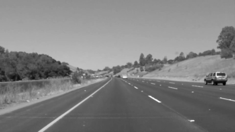
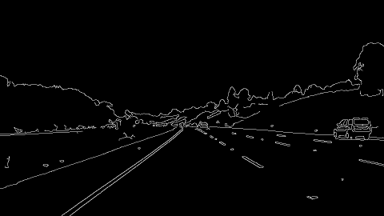
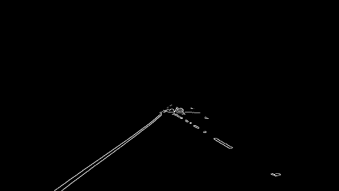
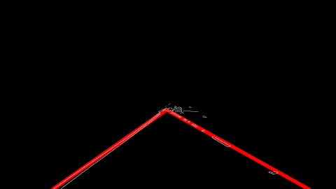

# **Finding Lane Lines on the Road**

### 1. Describe your pipeline. As part of the description, explain how you modified the draw_lines() function.

My pipeline consisted of 5 steps:

1. Convert the image to grayscale and apply a Gaussian blur.  For the parameters, I used `kernel_size = (5, 5)`.  

2. Apply Canny edge detection.  In line with the recommended 2:1 or 3:1 ratio of thresholds, I used `low_threshold = 50` and `  high_threshold = 150`.  

3. Apply a mask to the image outputted by Canny image detection.  I used a simple trapezoid mask.  

4. Apply the Hough Transform to the masked image from step 3.  

5. Process and filter the lines found by the Hough Transform.  

Steps 4 and 5 were performed in an iterative fashion.  I initialized the Hough Transform parameters as `threshold = 20`, `min_line_length = 200`, and `max_line_gap = 100`.  Since the output of the Hough Transform is a list called `lines` that consists of a pair of endpoints for each line, I sorted these lines by their length, from longest to shortest.  I extended these lines to the top and bottom of the masked image region.  I specified intervals at the bottom left, bottom right, and top of the image that the *x* coordinates of the endpoints should lie within, and I removed entries in the `lines` list whose endpoints fell outside these intervals.  I declared the longest line in `lines` to be one of the two lane lines, and for the other I took the longest remaining line whose slope was of the opposite sign as that of `lines[0]`.  

If this process did not yield two lines, then I divided in half the Hough parameters that I mentioned above and repeated steps 4 and 5.  

### 2. Identify potential shortcomings with your current pipeline

This is a simple lane detection pipeline, and as such it has a number of potential shortcomings.  

First, since we are fitting lines (not curves) to the lane lines, this pipeline may yield poor results on urban roads with sharp turns.  Second, it may struggle when there are signs in the road, such as arrows, crosswalks, or or words (e.g., "do not block").  It may also struggle when there are double lane lines (i.e., "do not cross" lines).  This pipeline may not be robust to different lighting.  Finally, it would probably have difficulty when there are a lot of cars on the road and the lane lines cannot be seen 100+ feet in front of the car.  

### 3. Suggest possible improvements to your pipeline

To more accurately detect the lane lines, it would be beneficial to fit a nonlinear curve to the lanes (such as a spline), instead of fitting a line.  

One issue that can be seen in the videos is that the lane lines sometimes jump around.  To obtain smoother results, we could incorporate information from the previous frame(s) when detecting lanes in the current frame.  
